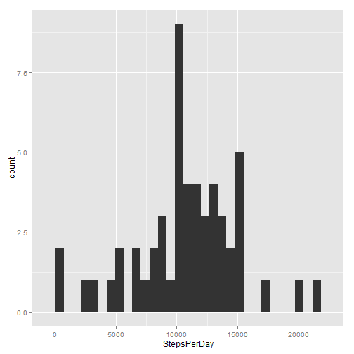
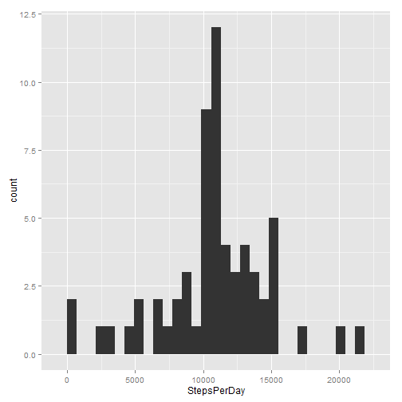

## Loading and preprocessing the data
Creating *data* folder in the working directory, downloading .zip file, unzipping .csv file:

```r
url <- "http://d396qusza40orc.cloudfront.net/repdata%2Fdata%2Factivity.zip"
if(!file.exists("./data")){dir.create("./data")}
download.file(url, "./data/activity.zip", mode="wb")
unzip("./data/activity.zip", exdir = "./data")
```
 
Reading in data:

```r
actDat <- read.csv("./data/activity.csv", colClasses = c("integer", "Date", "integer"))
```

## What is mean total number of steps taken per day?
Calculating the total number of steps taken each day:

```r
library(plyr)
total <- ddply(actDat, .(date), summarise, StepsPerDay = sum(steps))
```

Plotting the histogram of the total number of steps taken each day:

```r
library(ggplot2)
qplot(StepsPerDay, data=total)
```

```
## stat_bin: binwidth defaulted to range/30. Use 'binwidth = x' to adjust this.
```

 

Calculating the mean and median total number of steps taken per day:

```r
mean(total$StepsPerDay, na.rm=TRUE)
```

```
## [1] 10766.19
```

```r
median(total$StepsPerDay, na.rm=TRUE)
```

```
## [1] 10765
```


## What is the average daily activity pattern?
Calculating the average number of steps taken, averaged across all days:

```r
intMean <- aggregate(steps ~ interval, data = actDat, FUN = mean)
```

Plotting the average number of steps taken, averaged across all days:

```r
qplot(interval, steps, data = intMean, geom = "line")
```

 


The 5-minute interval, which on average across all the days in the dataset contains the maximum number of steps is given by:

```r
intMean$interval[which.max(intMean$steps)]
```

```
## [1] 835
```

## Imputing missing values
The total number of missing values in the dataset is:

```r
sum(!(complete.cases(actDat)))
```

```
## [1] 2304
```

To impute missing values in the dataset (NAs) we use the mean for that days:

```r
compDat <- merge(actDat, intMean, by.x="interval", by.y="interval")

compDat <- compDat[order(compDat$date), ]

compDat$steps <- compDat$steps.x

compDat$steps[is.na(compDat$steps)] <- compDat$steps.y[is.na(compDat$steps)]

compDat$steps.x <- NULL
compDat$steps.y <- NULL
```

Plotting the histogram of the total number of steps taken each day:

```r
total2 <- ddply(compDat, .(date), summarise, StepsPerDay = sum(steps))

qplot(StepsPerDay, data=total2)
```

```
## stat_bin: binwidth defaulted to range/30. Use 'binwidth = x' to adjust this.
```

 

The mean and median total number of steps taken per day are:

```r
mean(total2$StepsPerDay, na.rm=TRUE)
```

```
## [1] 10766.19
```

```r
median(total2$StepsPerDay, na.rm=TRUE)
```

```
## [1] 10766.19
```

## Are there differences in activity patterns between weekdays and weekends?
To ensure that the name of the days are in English:

```r
Sys.setlocale("LC_TIME", "English")
```

```
## [1] "English_United States.1252"
```

Creating a new factor variable with two levels – 'weekday' and 'weekend' indicating whether a given date is a weekday or weekend day:

```r
compDat$weekday <- weekdays(compDat$date)

compDat$day <- "weekday"
compDat$day[compDat$weekday == "Saturday"] <- "weekend"
compDat$day[compDat$weekday == "Sunday"] <- "weekend"

compDat$day <- factor(compDat$day)
```

Making a panel plot containing a time series plot of the 5-minute interval and the average number of steps taken, averaged across all weekday days or weekend days:

```r
intMean2 <- aggregate(steps ~ interval + day, data = compDat, FUN = mean)

library(lattice)

xyplot(steps ~ interval | day, data = intMean2, layout=c(1,2), type="l")
```

 
